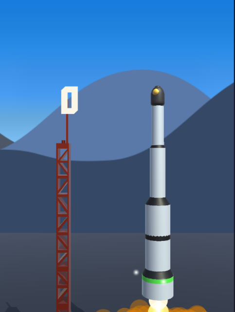
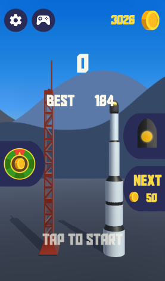
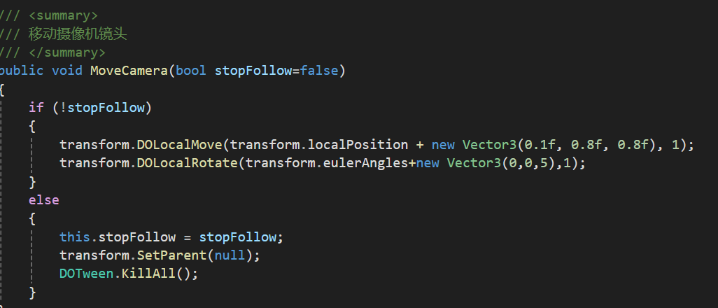
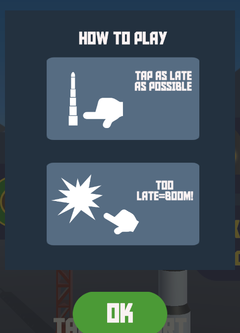
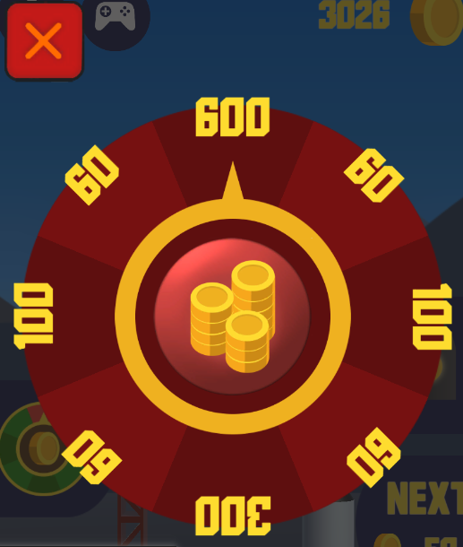
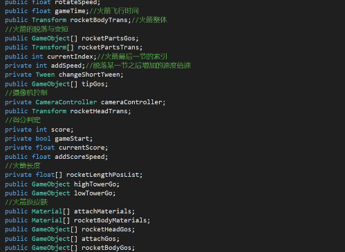
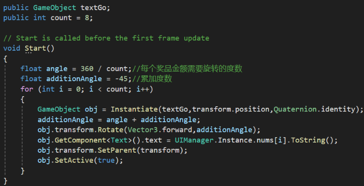
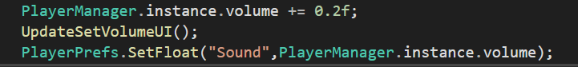

**游戏介绍：**

这是一款休闲反应类游戏。游戏中有一根默认5节的火箭，从最底下那节开始燃烧，玩家需在该节火箭未燃尽前点击脱落，剩余越短点击得分越高，若未及时点击致火箭燃烧完毕则会爆炸，游戏结束。

**技术支持：**

1.使用UGUI制作的游戏界面

2.DOTween插件实现摄像机跟随

3.脚本结合UI制作的新手指引、金币抽奖、皮肤抽奖等功能

**金币抽奖实现逻辑**

使用PlayerPrefs将游戏数据持久化

